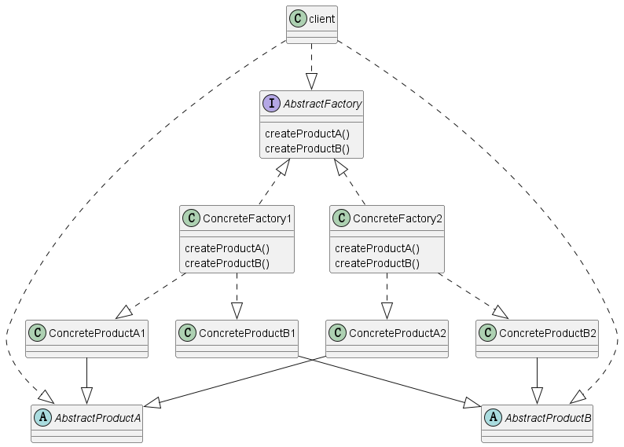

### 抽象工厂模式

>抽象工厂模式是一种创建型设计模式，它**提供了一个接口用于创建一系列相关或相互依赖的对象**，而无需指定其具体类。抽象工厂模式可以看作是**多个工厂方法模式的结合**，它能够创建不同类型的对象族，而不仅仅是单一类型的对象。

>在抽象工厂模式中，通常会有**两个层次的抽象**：一个是**抽象工厂类**，它声明了一组创建对象的方法，这些方法通常称为“工厂方法”；另一个是**具体工厂类**，它实现了抽象工厂类的方法，用于创建具体的产品对象

>同时，还有一组**抽象产品类和具体产品类**，分别对应于抽象工厂类和具体工厂类。抽象产品类定义了产品的规范，而具体产品类实现了抽象产品类定义的方法。

#### UML类


#### 示例

>创建不同类型的按钮和窗口:

>在这个示例中，Button 和 Window 分别是抽象产品，WindowsButton、MacButton、WindowsWindow、MacWindow 是具体产品。GUIFactory 是抽象工厂，WindowsFactory 和 MacFactory 是具体工厂。不同的工厂可以创建不同类型的按钮和窗口，从而创建不同类型的对象族。

```java
// 抽象产品：按钮
interface Button {
    void render();
}

// 具体产品：Windows 按钮
class WindowsButton implements Button {
    @Override
    public void render() {
        System.out.println("Rendering a Windows button");
    }
}

// 具体产品：Mac 按钮
class MacButton implements Button {
    @Override
    public void render() {
        System.out.println("Rendering a Mac button");
    }
}

// 抽象产品：窗口
interface Window {
    void renderWindow();
}

// 具体产品：Windows 窗口
class WindowsWindow implements Window {
    @Override
    public void renderWindow() {
        System.out.println("Rendering a Windows window");
    }
}

// 具体产品：Mac 窗口
class MacWindow implements Window {
    @Override
    public void renderWindow() {
        System.out.println("Rendering a Mac window");
    }
}

// 抽象工厂
interface GUIFactory {
    Button createButton();
    Window createWindow();
}

// 具体工厂：Windows 工厂
class WindowsFactory implements GUIFactory {
    @Override
    public Button createButton() {
        return new WindowsButton();
    }

    @Override
    public Window createWindow() {
        return new WindowsWindow();
    }
}

// 具体工厂：Mac 工厂
class MacFactory implements GUIFactory {
    @Override
    public Button createButton() {
        return new MacButton();
    }

    @Override
    public Window createWindow() {
        return new MacWindow();
    }
}

// 客户端使用
public class Main {
    public static void main(String[] args) {
        GUIFactory factory = new MacFactory();
        
        Button button = factory.createButton();
        button.render();
        
        Window window = factory.createWindow();
        window.renderWindow();
    }
}
```