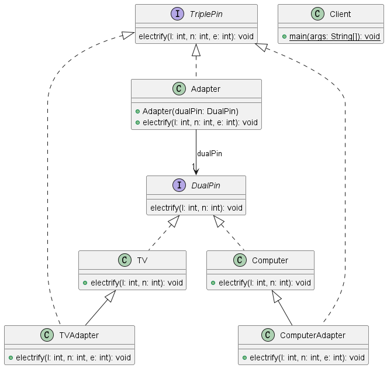

### 适配器模式

>适配器模式（Adapter Pattern）是一种结构型设计模式，它允许不兼容接口的对象之间合作。适配器模式主要用于将一个类的接口转换成客户端期望的另一个接口，从而使得原本因接口不匹配而无法协同工作的类能够一起工作。<br>
>适配器模式涉及三个主要角色：**目标接口（Target Interface）、适配器（Adapter）和被适配者（Adaptee）**。

* 目标接口（Target Interface）：这是客户端所期望的接口，它定义了客户端代码将要使用的方法
* 被适配者（Adaptee）：这是一个已经存在的类，它的接口与客户端所期望的接口不匹配。
* 适配器（Adapter）：适配器是一个中间层，它实现了客户端所期望的接口，并将客户端的请求转发给被适配者，以便完成操作。

### 两种适配器

* 类适配器：通过多重继承来实现适配器。适配器类继承了目标接口并同时继承了被适配者类。这种方法在某些编程语言中可能并不容易实现，因为多重继承在某些语言中是不支持的。
* 对象适配器：通过组合来实现适配器。适配器类包含一个被适配者的对象作为其一个属性，并实现了目标接口。这是一种更常用和灵活的方法。

### 一个示例

```java
// 被适配者：英国插座 
class UKSocket {     
  public void plugInUKSocket() {         
  System.out.println("Plugged into UK socket");     
  } 
}  
// 目标接口：中国插座 
interface ChinaSocket {     
  void plugInChinaSocket(); 
}  
// 适配器：通过组合方式实现适配 
class SocketAdapter implements ChinaSocket {     
  private UKSocket ukSocket;      
  public SocketAdapter(UKSocket ukSocket) {         
  this.ukSocket = ukSocket;     
}      
@Override     
public void plugInChinaSocket() {         
  ukSocket.plugInUKSocket();         
  System.out.println("Adapter converts UK socket to China socket");     
  } 
}  
// 客户端 
public class Client {     
  public static void main(String[] args) {         
  UKSocket ukSocket = new UKSocket();         
  SocketAdapter adapter = new SocketAdapter(ukSocket);         
  adapter.plugInChinaSocket();     
  } 
}
```

### 示例二：目标插头的三孔插座适配电器的二孔插座

```java
/**  
  * 目标接口  
  * @author wrjco  
  *  */ 
  public interface TriplePin {     
    public void electrify(int l,int n,int e); 
    }
    
/**  
  * 被适配接口  
  * @author wrjco  
  *  
  */ 
  public interface DualPin {     
  public void electrify(int l,int n); 
  }
  
/**  
  * 电视  
  * @author wrjco  
  *  
  */
   public class TV implements DualPin{     
     @Override     
      public void electrify(int l, int n) {         
      System.out.println("火线通电：" + l + ",零线通电："+n);         
      System.out.println("电视开机");     
        } 
      }
      
/**  
  * 电器  
  * @author wrjco  
  *  
  */ 
  public class Computer implements DualPin{      
  @Override     
  public void electrify(int l, int n) {         
  System.out.println("火线通电：" + l + ",零线通电："+n);        
  System.out.println("电脑开机");     
  } 
  }
  
/**  
* 对象适配器  
* @author wrjco  
*  
*/ 
public class Adapter implements TriplePin{      
    private DualPin dualPin;      
    public Adapter(DualPin dualPin){         
    this.dualPin = dualPin;     
}       
@Override     
    public void electrify(int l, int n, int e) {         
    dualPin.electrify(l,n);     
   } 
}

/**  
* 类适配器  
* @author wrjco  
*  
*/ 
public class TVAdapter extends TV implements TriplePin{     
@Override     
public void electrify(int l, int n, int e) {         
super.electrify(n,e);     
   } 
}

/**  
* 类适配器  
* @author wrjco  
*  
*/ 
public class ComputerAdapter extends Computer implements TriplePin{     
   @Override     
   public void electrify(int l, int n, int e) {         
   super.electrify(l, n);     
   } 
  }

/**  
* 客户端  
* @author wrjco  
*  
*/ 
public class Client {      
/**      
  *      
  * @param args      
  * 适配器模式：适配器模式涉及适配对象、适配器；有两种适配方式，对象适配器与类适配器      
  * 应用技术：继承（泛化）、实现（实现）、依赖、（关联、聚合、组合）      * 应用场景：      
  */     
  public static void main(String[] args) {           
  //TriplePin triplePin = new TV();  //接口不兼容，报错类型不匹配          
  //使用适配器         
  DualPin dualPinDevice = new TV();         
  TriplePin triplePinDevice = new Adapter(dualPinDevice);        
  triplePinDevice.electrify(1,0,-1);          
  DualPin dualPinComputer = new Computer();         
  TriplePin triplePinComputer = new Adapter(dualPinComputer);         
  triplePinComputer.electrify(1,0,-1);          
  //类适配器         
  TriplePin tvAdapter = new TVAdapter();         
  tvAdapter.electrify(1,0,-1);          
  TriplePin computerAdapter = new ComputerAdapter();         
  computerAdapter.electrify(1,0,-1);     
  } 
 }
```




