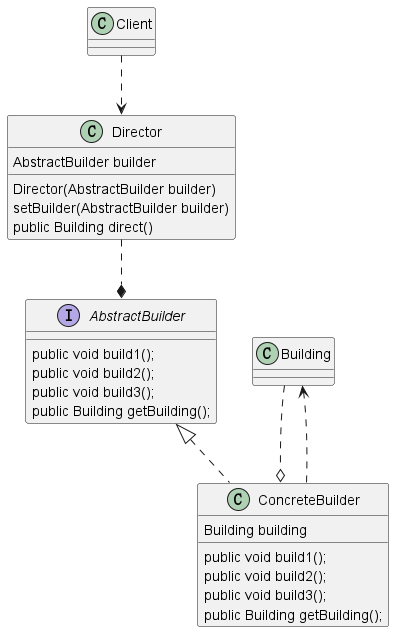

### 构造者模式

#### UML

>构造模式各个角色之间的关系如下图



#### 角色

* 指导者:负责协调构造过程，通常通过给定的步骤创建产品。非必需，但可以简化客户端的代码。
* 抽象构造者：定义了创建产品的方法和步骤，通常包括设置产品的属性、选项等
* 具体构造者：实现抽象构造者接口，负责实际构建产品的具体步骤。
* 产品：最终创建的复杂对象，包含了多个组成部分。

#### 应用场景

>当我们需要创建复杂对象时，通常需要设置多个属性和选项。在这种情况下，构造函数可能会变得非常冗长，难以管理。构造者模式旨在通过将对象的构建过程与其表示分离，使得创建复杂对象变得更加灵活和可读。

#### 具体例子

>假设我们要创建一份计算机对象，它有许多属性，例如处理器、内存、硬盘等。构造过程可能会很复杂，涉及不同类型的计算机（台式机、笔记本电脑等）。
>我们可以使用构造者模式来解决这个问题
```java
// 产品类 
class Computer {     
    private String processor;     
    private int memory;     
    private int hardDisk;      
    // 省略构造函数、Getter和Setter 
}  
// 抽象构造者 
interface ComputerBuilder {     
    void buildProcessor(String processor);     
    void buildMemory(int memory);     
    void buildHardDisk(int hardDisk);     
    Computer getResult(); 
}  
// 具体构造者 
class DesktopComputerBuilder implements ComputerBuilder {     
    private Computer computer = new Computer();      
    @Override     
    public void buildProcessor(String processor) {         
        computer.setProcessor(processor);     
    }      
    @Override     
    public void buildMemory(int memory) {         
        computer.setMemory(memory);     
    }      
    @Override     
    public void buildHardDisk(int hardDisk) {         
        computer.setHardDisk(hardDisk);     
    }      
    @Override     
    public Computer getResult() {         
        return computer;     
    } 
}  
// 指导者 
class ComputerDirector {     
    private ComputerBuilder builder;      
    public ComputerDirector(ComputerBuilder builder) {         
        this.builder = builder;     
    }      
    public Computer buildComputer() {         
        builder.buildProcessor("Intel Core i7");         
        builder.buildMemory(16);         
        builder.buildHardDisk(512);         
        return builder.getResult();     
    } }  
// 客户端使用 
public class Main {     
    public static void main(String[] args) {         
        ComputerBuilder builder = new DesktopComputerBuilder();         
        ComputerDirector director = new ComputerDirector(builder);         
        Computer computer = director.buildComputer();     
    } 
} 
```