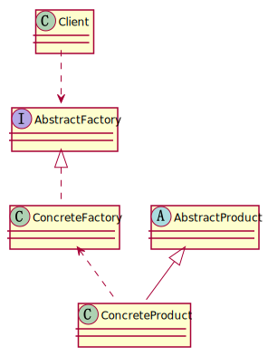

### 工厂方法模式

>工厂方法模式是一种**创建型**设计模式，它定义了一个用于**创建对象的接口**，但将**实际创建对象的过程推迟到子类**中。这使得客户端代码在不必指定所创建对象的具体类的情况下，就能够创建对象。

>工厂方法模式适用于需要**创建一组相关对象的场景**，这些**对象具有共同的接口或基类**，但其具体实现可能不同。

#### UML

>如下图，以UML展示了工厂方法模式中各个角色之间的关系



#### 示例

>以下是一个简单的工厂方法模式示例，假设我们要创建不同类型的日志记录器：

>在这个示例中，Logger 是抽象产品，FileLogger 和 DatabaseLogger 是具体产品。LoggerFactory 是抽象工厂，FileLoggerFactory 和 DatabaseLoggerFactory 是具体工厂。

```java
// 抽象产品：日志记录器 
interface Logger {     
void log(String message); 
}  

// 具体产品：文件日志记录器 
class FileLogger implements Logger {     
@Override     
        public void log(String message) {         
            System.out.println("Logging message to file: " + message);     
        } }  
        
// 具体产品：数据库日志记录器 
class DatabaseLogger implements Logger {     
@Override     
public void log(String message) {         
System.out.println("Logging message to database: " + message);     
} }  

// 抽象工厂：日志记录器工厂 
interface LoggerFactory {     
Logger createLogger(); 
}  

// 具体工厂：文件日志记录器工厂 
class FileLoggerFactory implements LoggerFactory {     
@Override     
public Logger createLogger() {         
return new FileLogger();     
} } 
 
// 具体工厂：数据库日志记录器工厂 
class DatabaseLoggerFactory implements LoggerFactory {     
@Override     
public Logger createLogger() {         
return new DatabaseLogger();     
} }  

// 客户端使用 public class Main {     
public static void main(String[] args) {         
LoggerFactory factory = new FileLoggerFactory();         
Logger logger = factory.createLogger();         
logger.log("This is a log message.");     
} }
```java